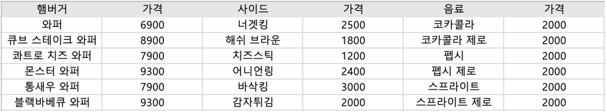

# 기능 목록

## 1. 기능 목록

- [ ] 프로그램의 실행되면 홈 화면이 출력되며 홈 화면에는 아래와 같은 메뉴 항목이 존재해야 한다
    1. 햄버거
    2. 사이드
    3. 음료
    4. 장바구니
    5. 종료

    - [ ] 잘못된 메뉴를 선택한 경우 IllegalArgumentException을 발생시키고 프로그램을 종료한다.
        - [ ] 숫자가 1 ~ 5 사이가 아닌 경우
        - [ ] 숫자가 아닌 경우

- [ ] 햄버거 또는 사이드 또는 음료를 선택했을 경우 아래 요구사항을 수행한다
    - [ ] 햄버거 또는 사이드 또는 음료 리스트를 가격과 함께 출력해야 한다 (각 메뉴는 아래의 항목으로 고정한다)
    - 
    - [ ] 사용자는 출력된 메뉴 중 하나를 선택할 수 있어야 한다(0을 선택 시 홈으로)
        - [ ] 잘못된 메뉴를 선택한 경우 IllegalArgumentException을 발생시키고 프로그램을 종료한다.
            - [ ] 숫자가 메뉴 범위 밖인 경우
            - [ ] 숫자가 아닌 경우
    - [ ] 선택한 메뉴는 장바구니에 담겨야 한다
    - [ ] 메뉴를 선택한 뒤에는 완료 메세지 출력 후 홈으로 이동해야 한다

- [ ] 장바구니를 선택했을 경우 아래 요구사항을 수행한다
    - [ ] 현재 장바구니에 담겨있는 항목과 수량을 출력해야 한다
        - [ ] 사용자는 아래와 같은 메뉴 중 하나를 선택할 수 있어야 한다 (0을 선택 시 홈으로)
            - [ ] 주문하기성
                - [ ] 주문완료 메세지를 출력 후 애플리케이션을 종료한다
            - [ ] 수량 조절하기
                - [ ] 현재 장바구니에 담겨있는 항목과 수량을 출력해야 한다
                - [ ] 사용자는 아래와 같은 순서로 수량을 변경할 수 있다
                    - [ ] 수량을 조절할 메뉴 번호를 선택 (0을 선택 시 홈으로)
                    - [ ] 변경할 수량을 입력
                        - [ ] 잘못된 수량을 입력한 경우 IllegalArgumentException을 발생시키고 프로그램을 종료한다.
                            - [ ] 숫자가 1 ~ 50 사이가 아닌 경우
                            - [ ] 숫자가 아닌 경우
                - [ ] 수정을 완료하면 메세지 출력 후 장바구니 화면으로 돌아와야 한다
            - [ ] 삭제하기
                - [ ] 현재 장바구니에 담겨있는 항목과 수량을 출력해야 한다
                - [ ] 사용자는 삭제할 항목을 선택할 수 있어야 한다 (0을 선택 시 홈으로)
                    - [ ] 잘못된 메뉴를 선택한 경우 IllegalArgumentException을 발생시키고 프로그램을 종료한다.
                        - [ ] 숫자가 메뉴 범위 밖인 경우
                        - [ ] 숫자가 아닌 경우
                - [ ] 삭제하기 전에 사용자의 확인을 받아야 한다
                - [ ] 삭제를 완료하면 완료 메세지 출력 후 장바구니 화면으로 돌아와야 한다

- [ ] 종료 메뉴를 선택했을 경우
    - [ ] 종료 메세지를 출력후 애플리케이션을 종료한다